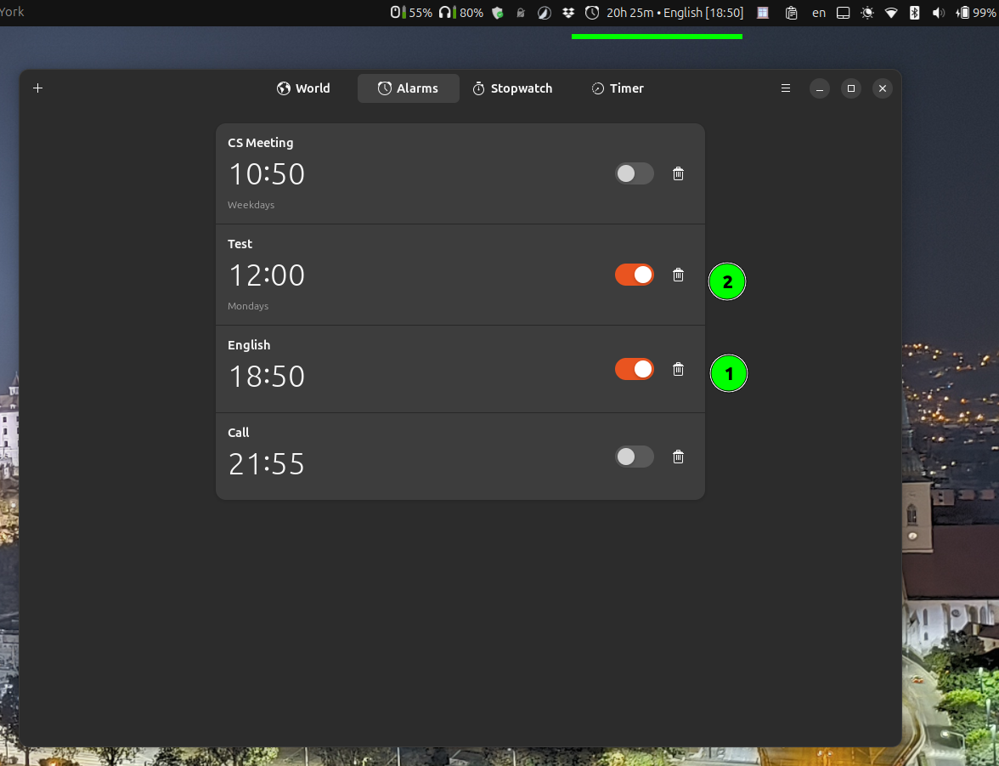

# Gnome Alarms

Panel indicator for GNOME Shell showing the next alarm from Gnome Clocks and offering a quick-open control.

This GNOME Shell extension was created for personal use and inspired by [pacoqueen/gnome-shell-alarm](https://github.com/pacoqueen/gnome-shell-alarm).


## Description

This indicator fetches the list of alarms from the **Gnome Clocks** application and displays the time until the next scheduled alarm.
> **Note:** You must have Gnome Clocks installed natively for the extension to work:
> ```sh
> sudo apt install gnome-clocks
> ```
The extension can also show alarms set for more than one day ahead.

## Example: Setting Alarm Time and Name

Below is an example of how to set the time and name for an alarm in the Gnome Clocks application:



## Features

- Visual control of Gnome Clock's alarms directly from the GNOME Shell.
- Shows the time remaining until the next alarm, including alarms set for more than 24 hours.

## Manual Installation

1. **Clone or download** this repository.

2. **Copy the extension folder** to your local GNOME Shell extensions directory:
   ```sh
   mkdir -p ~/.local/share/gnome-shell/extensions/
   cp -r gnome-alarms@igolskyi.github.io ~/.local/share/gnome-shell/extensions/
   ```

3. **Restart GNOME Shell**:
   - On **X11**: Press <kbd>Alt</kbd>+<kbd>F2</kbd>, type `r`, and press <kbd>Enter</kbd>.
   - On **Wayland**: This method does not work; you need to log out and log back in.

4. **Enable the extension** using GNOME Extensions app or via command line:
   ```sh
   gnome-extensions enable gnome-alarms@igolskyi.github.io
   ```

## Requirements

- GNOME Shell 46
- Gnome Clocks installed natively (not via Snap or Flatpak)

## License

Personal use.
